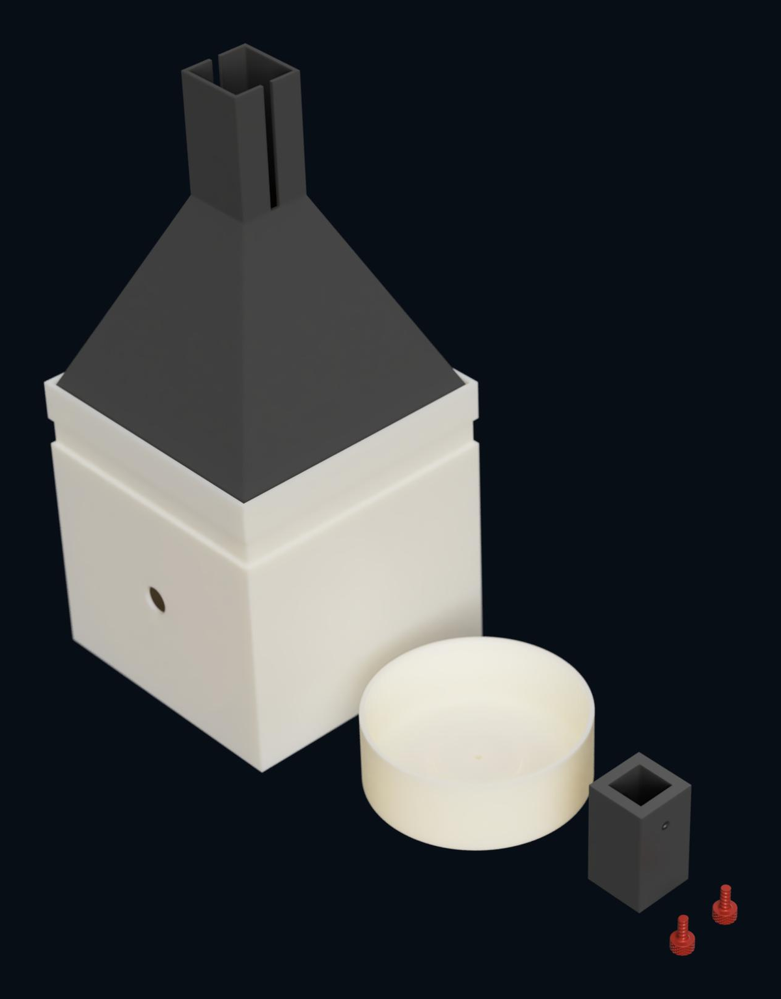
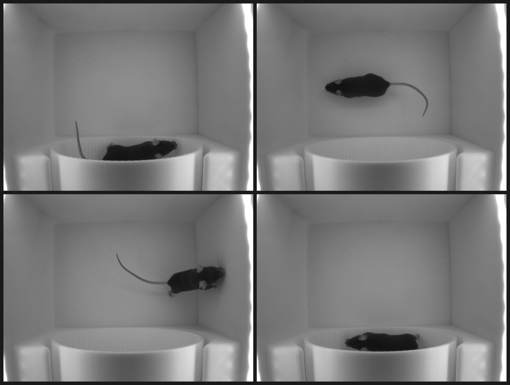

# Behaviour Box Mini
A deliberately simple, open-source box for recording mouse locomotion, built as a first step
towards scalable behavioural phenotyping. About **£1095** a box, six printed parts, half an hour to
assemble.

## Overview

Every part is either printed or bought off the shelf, nothing needs machining, and the printed
parts need no supports. Simplicity is the point: a box that is quick to replicate, cheap enough to
run in parallel, and hard to set up wrongly.

The box pairs video capture with rotary-encoder wheel tracking, using Harp for synchronised
timestamping and Bonsai for control and acquisition. The aim is to pre-screen animals before
downstream experiments, so behavioural differences show up early — improving experimental
efficiency and reducing the number of animals needed later.

*Four frames from a single session. The wheel is against the far wall; the mouse is tracked by
centroid in both the arena and the wheel, under 850 nm light it cannot see.*

## What you get

- **Video** — continuous capture at 50 Hz for observation and offline analysis
- **Wheel locomotion** — cumulative running distance from a 1024 ppr encoder, sampled per frame
- **One clock** — the Harp board triggers the camera and timestamps the encoder, so the two streams
  share a time base rather than being aligned afterwards

## Bill of materials

| # | Part | Qty | Supplier | Cost (£) | Notes |
|---|------|-----|----------|------|-------|
| 1 | [PLA filament](https://uk.store.bambulab.com/products/pla-basic-filament) | 2 | Bambu Lab | 36 | 18 each |
| 2 | [FLIR Blackfly S camera](https://www.digikey.co.uk/en/products/detail/flir-integrated-imaging-solutions-inc/BFS-U3-16S2M-CS/16528335) | 1 | DigiKey | 277 | BFS-U3-16S2M-CS |
| 3 | [Rotary encoder](https://www.aliexpress.com/item/1005005665235932.html) | 1 | AliExpress | 18 | **1024 ppr** version, see notes |
| 4 | [Harp Behaviour Board](https://open-ephys.org/harp/oeps-1216) | 1 | Open Ephys | 415 | Listed at €510 |
| 5 | [Locking USB 3.0 Micro-B cable](https://www.amazon.co.uk/dp/B0BYDYKB75) | 1 | Amazon | 18 | 5 m, straight connector |
| 6 | [GPIO cable](https://www.digikey.co.uk/en/products/detail/flir-integrated-imaging-solutions-inc/ACC-01-3010/16528421) | 1 | DigiKey | 33 | Camera trigger. FLIR ACC-01-3010, Hirose HR10 6-pin, 4.5 m |
| 7 | [Varifocal lens, 2.8-12 mm, CS mount](https://www.aliexpress.com/item/1005006136279769.html) | 1 | AliExpress | 12.49 | Manual zoom and focus, no IR filter |
| 8 | [IR LED strip, 850 nm, 12 V](https://www.aliexpress.com/item/1005009046927133.html) | 2 m | AliExpress | 26 | Cut to length. Three walls need about 0.6 m |
| 9 | [Mini PC, e.g. GEEKOM Air12](https://www.amazon.co.uk/dp/B0CPLNDHZ5) | 1 | Amazon | 240 | Meets the minimum specification below |
| 10 | [M3 hex screw set, 6-14 mm](https://www.aliexpress.com/item/1005008068815080.html) | 1 | AliExpress | 9 | May be optional, see notes |
| 11 | [RJ45 breakout](https://www.aliexpress.com/item/1005009050450182.html) | 1 | AliExpress | 2 | Gets the encoder wires into Port 2 |
| 12 | [Screw terminal blocks, 5-way](https://www.aliexpress.com/item/1005007993530438.html) | 1 | AliExpress | 6.25 | Pack of 10. One terminates the encoder |
| 13 | [12 V power supply](https://www.aliexpress.com/item/4000056698173.html) | 1 | AliExpress | 2.45 | For the IR LED strip |

Approximate total: £1095

**Notes**

- **Encoder resolution** — row 3 is sold in several resolutions off the same listing, and they are
  indistinguishable in the product photographs. Choose **1024 ppr**: the workflow ships with
  `CountsPerRev` set to 4096, which is 1024 quadrature-decoded x4. Fit a different resolution
  without changing that value and `WheelDistance` is wrong in every recording, with nothing in the
  data to say so. See [Software](Software/).
- **Rotary encoder alternative** — [Omron E6B2-CWZ6C 360P/R 0.5M](https://uk.rs-online.com/web/p/motion-control-sensors/2158863),
  RS stock 215-8863, £216.14 exc VAT. Same NPN open-collector output and 6 mm shaft, but 360 ppr
  rather than 1024, and about twelve times the price. Worth it only if you need a warranted part.
  It needs `CountsPerRev` changed to 1440.
- **Screws** — Omron encoders ship with an E69-2 bracket and three M3 x 10 Phillips screws, which may
  cover the encoder mount on their own. The assembly guide calls for three M3 x 8 mm hex screws and a
  2 mm Allen key, so check what arrives before ordering row 10.

### Computer minimum specification

One machine per box runs Bonsai and writes the video. The GEEKOM Air12 in row 9 is the cheapest
unit we have found that clears the bar, so its specification is the floor:

| | Minimum |
|---|---|
| CPU | 4-core x86, Intel N-series or PT7505 class |
| RAM | 16 GB |
| Storage | 512 GB NVMe SSD |
| USB | One USB 3.2 Gen 1 Type-A port dedicated to the camera |
| OS | Windows 11, for Bonsai and the Spinnaker SDK |

Two things to watch:

- **No PCIe slot** on a mini PC, so the camera runs from a built-in port rather than an expansion card.
- **Storage** — compressed video runs at roughly 1-4 GB per hour, so 512 GB holds weeks. Uncompressed
  it would fill in about seven hours, at the shipped 720 x 540 and 50 Hz.

## Build guide

Four steps, a couple of days of printing and half an hour of assembly.

| Step | What it involves | Guide |
|---|---|---|
| 1. Print | Six parts in one STL: box body, lid, camera holder, running wheel and two screws. 15% infill, no supports, three plates on a standard Bambu Lab printer or equivalent. | [Assembly](Assembly/) |
| 2. Assemble | Mount the encoder, fit the wheel to its D-shaft, clamp the camera in its holder with the lens, and line three walls with the IR strip. 20-30 minutes. | [Assembly](Assembly/) |
| 3. Wire | Camera to computer over locking USB, GPIO trigger and encoder to the Harp board. | [Wiring](Assembly/Wiring.md) |
| 4. Software | Install the Spinnaker SDK, run `Setup.cmd`, open the workflow. | [Software](Software/) |

### Installing the software

Order matters: Bonsai cannot see the camera without the Spinnaker driver already in place.

1. **Spinnaker SDK 4.2.0.83** — download from
   [Teledyne Vision Solutions](https://www.teledynevisionsolutions.com/support/support-center/software-firmware-downloads/iis/spinnaker-sdk-download/spinnaker-sdk--download-files/?pn=Spinnaker+SDK&vn=Spinnaker+SDK).
   The version must match exactly; the download page defaults to the latest, so choose deliberately.
   An account is required, so this step cannot be scripted.
2. **Bonsai** — run `Software\Setup.cmd`. It downloads Bonsai and
   restores every package from `Bonsai.config`, and warns if Spinnaker is missing or the wrong
   version. Nothing else needs installing by hand.
3. **Open the workflow** — start Bonsai, then **File → Open** →
   `Behaviour_Box_Mini.bonsai`. Do not launch the workflow file directly: this project relies on
   compatibility patches.

Full detail, including camera settings, is in [Software](Software/).

## How to run the workflow

Configure the camera and experiment settings first — see [Software](Software/). Then:

1. Clean the box with **70% ethanol** or another disinfectant, and wipe it completely dry.

2. Connect the hardware, with the box still empty:
   - 12 V power supply to the Harp Behaviour Board
   - Rotary encoder to the Harp Behaviour Board (**Port 2**)
   - IR LED strip power supply
   - Camera USB cable to the computer
   - Camera GPIO trigger cable to the Harp Behaviour Board

3. Open the Bonsai workflow and check the **live camera preview** is updating.

4. Place the mouse in the box.

5. Fit the lid with the camera attached.

6. Minimise external light — turn the room lights off, or cover the box with black fabric (**recommended**).

7. Set the save directory, camera serial number, subject ID, session ID and trial length, then click
   **Start**.

8. Recording stops automatically at the trial length, saving a video and a CSV of the behavioural data.

9. Return the mouse to its home cage.

10. Clean the box before the next recording, checking the corners carefully — faeces are easy to miss.

## Troubleshooting

- **No live camera preview** — check the locking USB 3.0 cable is connected, the correct Spinnaker
  SDK version is installed, and the camera serial number matches the connected device.
- **Rotary encoder not responding** — check the RJ45 connection to the Harp Behaviour Board and that
  the encoder is on the correct input pins.
- **Preview or CSV window missing** — reopen them manually, as below.

### Reopening the camera preview

1. Right-click the **Logging** node and select **Show Default Editor...**
2. In the editor window, right-click the **LogVideo** node and select **Show Default Editor...**
3. Right-click the **VideoWriter** node and select:
   - **Show Visualizer**
   - **Bonsai.Vision.Design.IplImageVisualizer**

### Reopening the CSV output

1. Right-click the **CsvWriter** node.
2. Select:
   - **Show Visualizer**
   - **Bonsai.Design.ObjectTextVisualizer**

> **Tip**
>
> Do not close these visualizer windows by hand. Bonsai closes them when the workflow stops, and
> reopens them on the next run.

## License

Released under the [MIT License](LICENSE), which covers the printed design as well as the workflow
and the documentation.

The five UclOpen packages in `local_packages/` are redistributed under the BSD 3-Clause License, and
everything `Setup.cmd` downloads stays under its own terms. See
[THIRD-PARTY-NOTICES.md](THIRD-PARTY-NOTICES.md).
