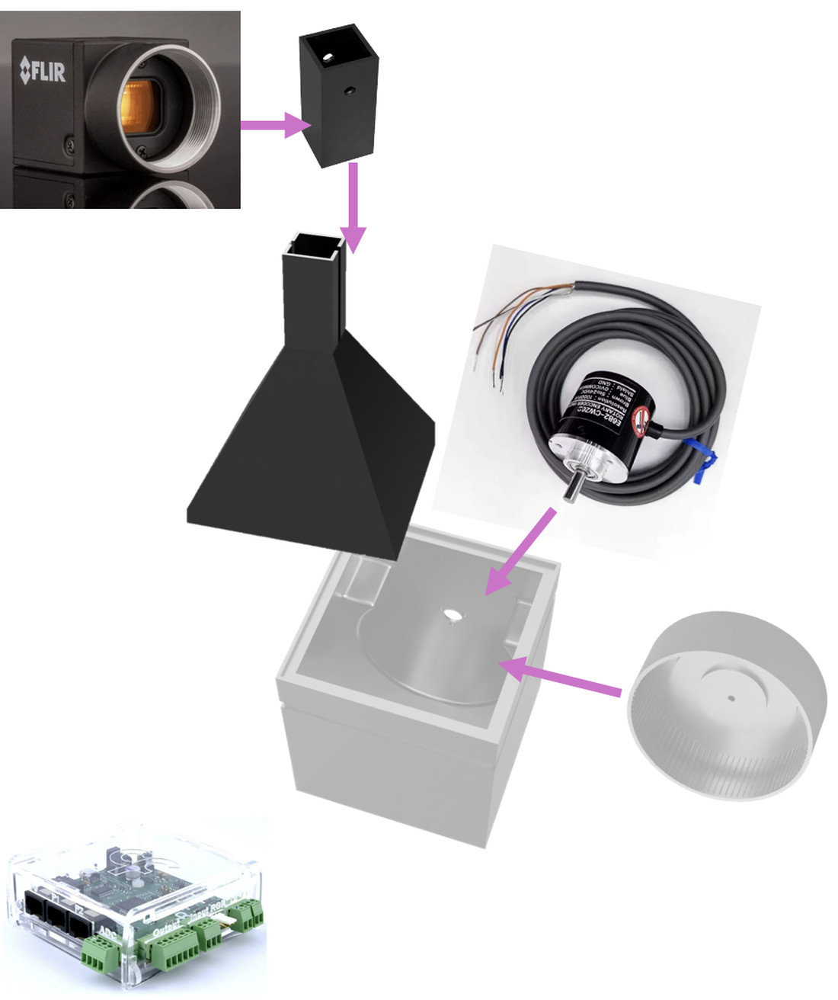

# Assembly Guide

The Mini Behaviour Box consists of four 3D-printed components:
Behaviour box body
Lid
Camera holder
Running wheel

All printed parts are designed for PLA. The remaining hardware and electronics should be purchased separately as listed in the Bill of Materials.

  

（Estimated assembly time: ~20–30 minutes）

## Tools Required
2 mm Allen key (for M3 screws)

Flat-head screwdriver

## Step 1 - Print the Components
Print the following four PLA components:
Behaviour box body
Lid
Camera holder
Running wheel

## Step 2 — Install the Rotary Encoder
Secure the rotary encoder to the side wall of the behaviour box using three M3 × 8 mm screws.
Ensure that the encoder shaft is facing towards the inside of the box.
Refer to the Wiring section for encoder connections.

## Step 3 - Install the Running Wheel
Slide the running wheel onto the encoder shaft.
The wheel is designed to mate with the D-shaped encoder shaft
Align the flat side of the shaft with the matching flat section inside the wheel hub before pushing the wheel fully into position. The wheel should slide on smoothly without excessive force.

## Step 4 - Install the Camera
Remove the lens from the camera body.
Insert the camera through the camera holder from the rear.
Reattach the lens from the front so that the camera holder is clamped securely between the camera body and the lens, preventing any movement of the holder.
Refer to the Wiring section for camera power and trigger connections.

