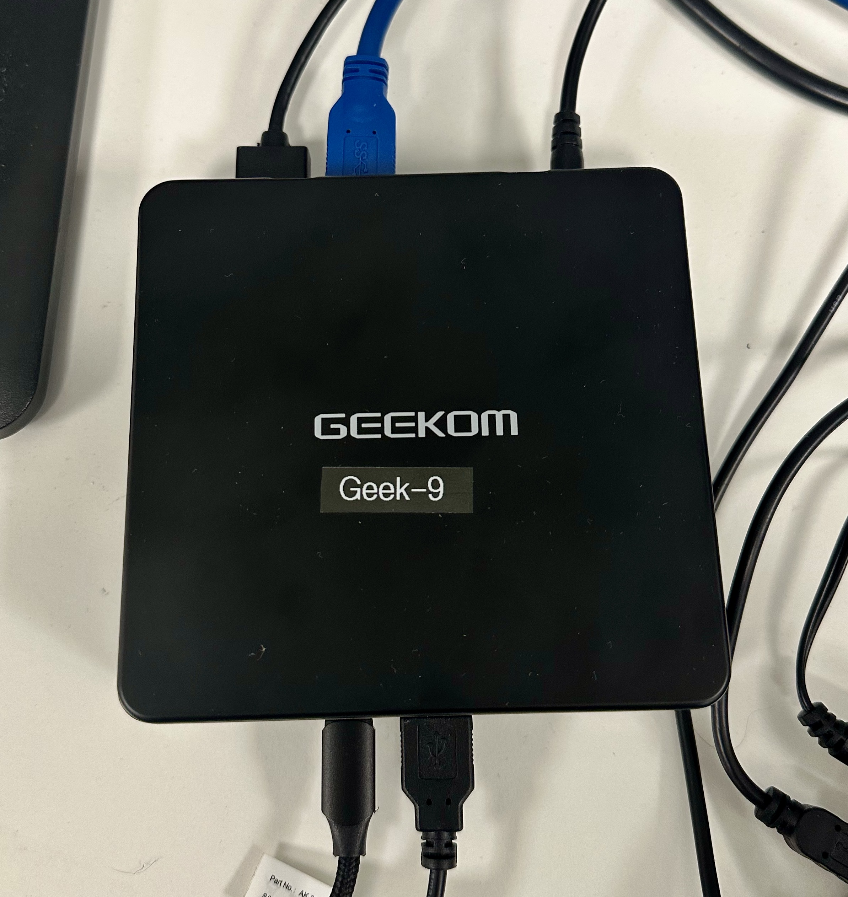
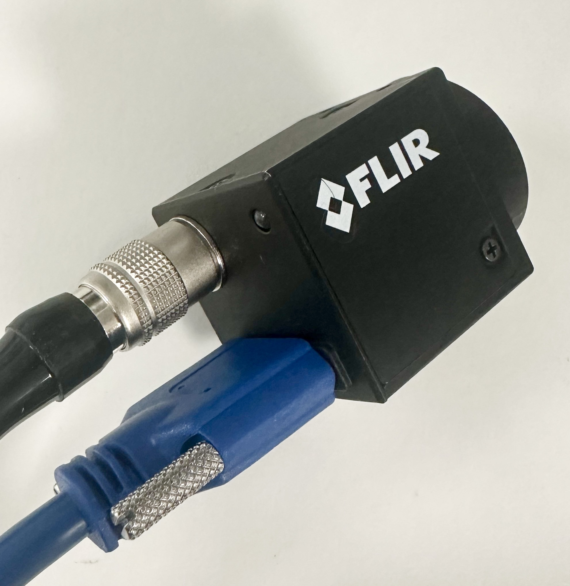
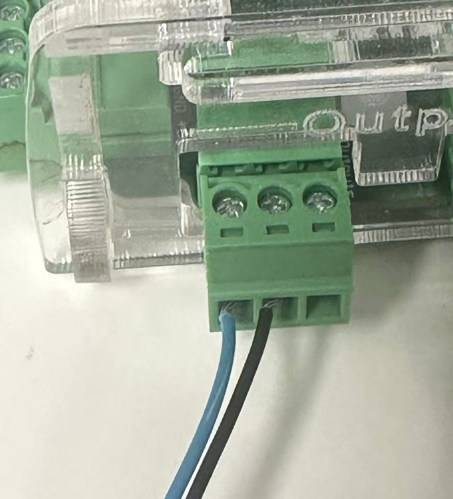
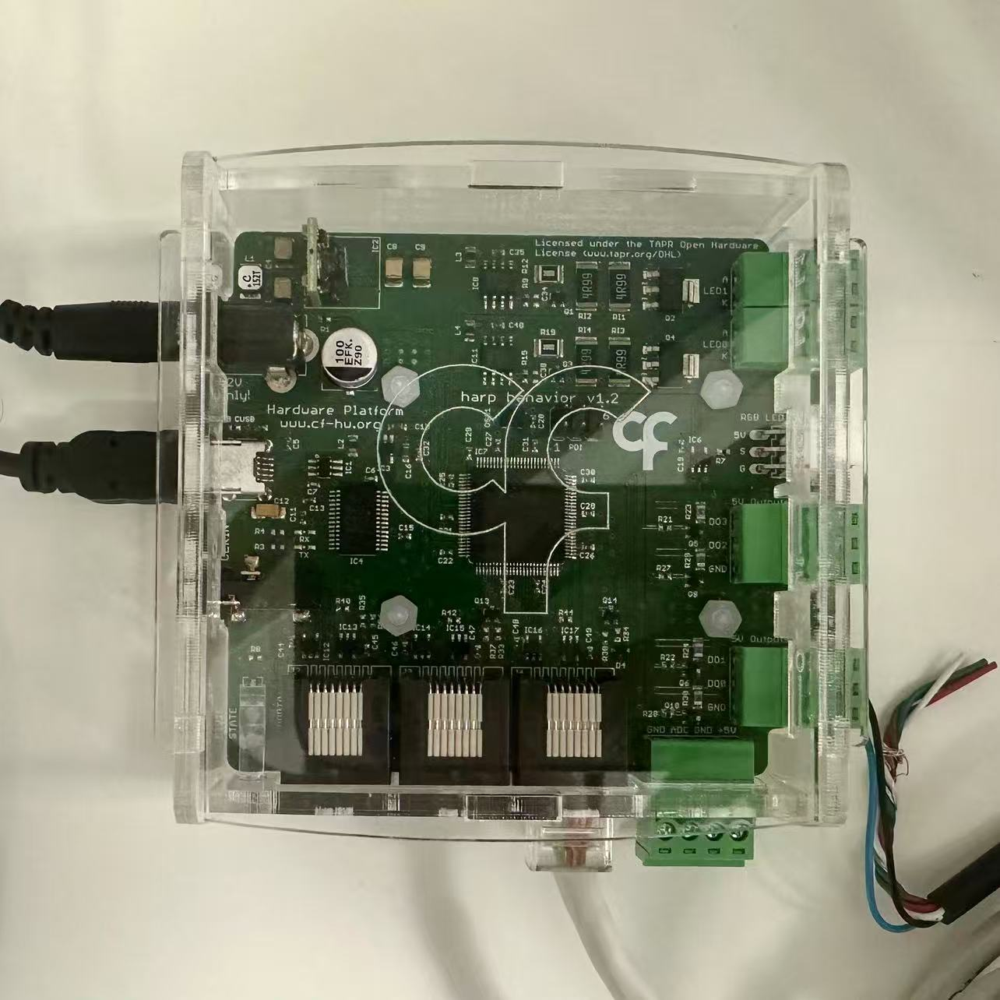

# Wiring

Three things connect to the system: the camera, the rotary encoder and the Harp Behaviour Board.

  

---

## Camera

The camera needs two connections:

- **Locking USB 3.0 Micro-B cable** — straight to the computer, for image acquisition.
- **GPIO trigger cable** — to the **Output** port of the Harp Behaviour Board, for hardware triggering.

For the **FLIR Blackfly S (BFS-U3-16S2M-CS)** in the bill of materials:

| Camera wire | Connect to |
|-------------|------------|
| Blue (Opto GND) | GND |
| Black (Opto In) | Trigger |

  
  

Camera configuration is covered in [software](../Software/).

---

## Rotary encoder

The encoder connects to the Harp Behaviour Board over RJ45, on **Port 2**. This is not a preference:
Port 2 is the only one of the three ports wired to the board's quadrature counter, and the workflow
enables it by name. To simplify assembly and replacement, terminate the encoder wires in a **5-way
screw terminal block** first.

The encoder has five wires, four of which are used:

| Encoder wire | Harp pin |
|--------------|----------|
| Black (Channel A) | DI (Input A) |
| White (Channel B) | DIO (Input B) |
| Orange — *not used* | Pin 3 |
| Brown (+5 V) | Pin 4 |
| Blue (GND) | Pin 5 |

The bare braid is the cable shield, not one of the five wires.

  

---

## Harp Behaviour Board

The board is the central interface between camera, encoder and computer. It needs:

- USB to the computer
- 12 V DC power in
- GPIO output to the camera trigger cable
- RJ45 to the rotary encoder (**Port 2**, the only port with a quadrature counter)

  

With the hardware connected, go to [software](../Software/) for device configuration and
acquisition.
